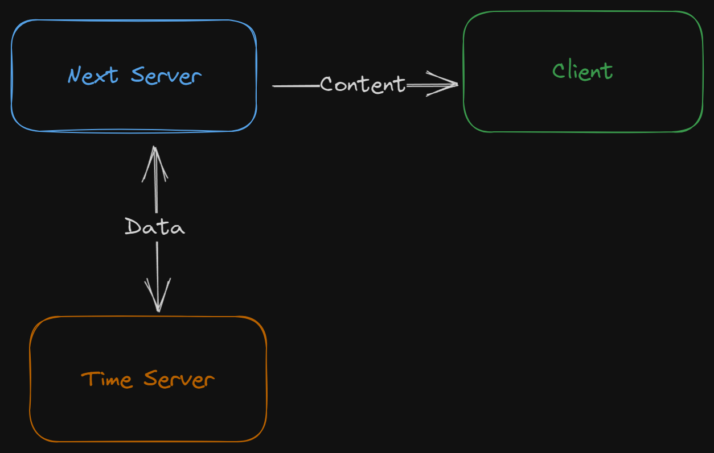
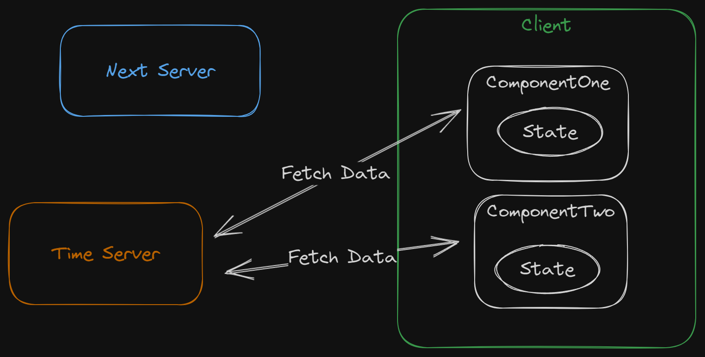
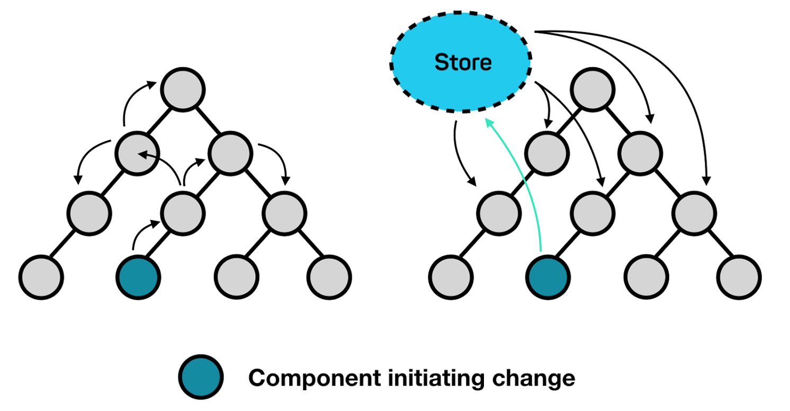
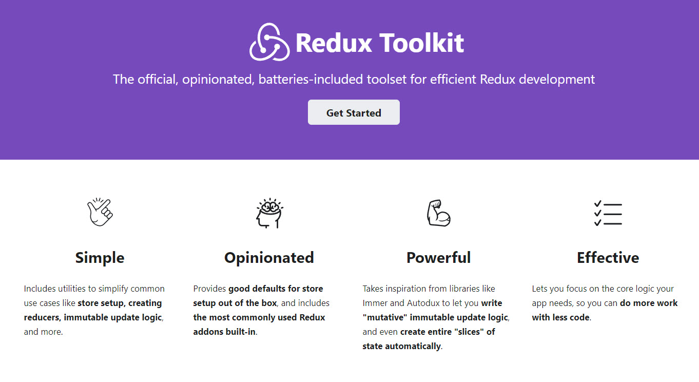

<style>
@import url('https://fonts.googleapis.com/css2?family=Prompt:ital,wght@0,100;0,300;0,400;0,700;1,100;1,300;1,400;1,700&display=swap');

    :root {
    font-family: Prompt;
    --hl-color: #D57E7E;
}
h1 {
  font-family: Prompt
}
</style>

# Fullstack Development

---

# Data Fetching in React / NextJS

https://github.com/fullstack-66/data-fetching

---

# Time server

### Local

- Clone https://github.com/fullstack-66/time-server
- `npm install`, `npm start`
- `http://localhost:3001`

### Cloud

- https://time-server-production-f0f6.up.railway.app/

---

# Setup NextJS project

`npx create-next-app@latest`

---

# Configure import

`tsconfig.json`

```json
{
  "baseUrl": ".",
  "paths": {
    "@app/*": ["app/*"],
    "@components/*": ["components/*"]
  }
}
```

- Note, if you don't define `baseUrl`, you need to prefix the path with `./`.

---

# API Endpoint

`./utils/index.ts`

```ts
if (!process.env.NEXT_PUBLIC_API_URL) {
  throw new Error("NEXT_PUBLIC_API_URL is not set");
}
export const API_URL = process.env.NEXT_PUBLIC_API_URL;
```

---

# Create additional page

`./app/another/page.tsx`

```js
export default function AnotherPage() {
  return <div>Another Page</div>;
}
```

---

# Add navigation

`./app/layout.tsx`

```ts
import Link from "next/link";
// ...
export default function RootLayout(...) {
  return (
    <html lang="en">
      <body className={inter.className}>
        <div className="flex gap-2 mb-4">
          <Link href="/">Home</Link> 👈
          <Link href="/another">another</Link> 👈
        </div>
        <div className="m-4">{children}</div>
      </body>
    </html>
  );
}
```

---

# Fetching #1: Server component

- `./components/t1_serverComponent/index.tsx`
- Notice the caching behavior.

---



---

# Also used

- `DisplayTime` component from `./components/utils/displayTime.tsx`
- Type from `./components/uitls/types.ts`
  - Generated using `Paste as Code` extension.

---

# Fetching #2: `useEffect` way

`./t2_clientUseEffectOne/index.ts`
`./t2_clientUseEffectTwo/index.ts`

---



---

# Global store pattern

What does using a global store solve?

- Multiple copies of states
- Prop drilling
- Unncessary re-render

---



---

# Global store libraries / API

- `React Context`
- `Redux`
- `Jotai`
- `Zustand`

---

# React Context

- Native API
- Fine, but...

---

```ts
const App = () => {
  // ... some code
  return (
    <>
      <ReduxProvider value={store}>
        <ThemeProvider value={theme}>
          <OtherProvider value={otherValue}>
            <OtherOtherProvider value={otherOtherValue}>
              {/** ... other providers*/}
              <HellProvider value={hell}>
                <HelloWorld />
              </HellProvider>
              {/** ... other providers*/}
            </OtherOtherProvider>
          </OtherProvider>
        </ThemeProvider>
      </ReduxProvider>
    </>
  );
};
```

---

# Redux

- Powerful
- Has Redux Dev Tool
- Can be used standalone
- Too much boiler plate for small projects

---



---

## 

---

# Zustand

- Minimalist
- Use Redux-style (flux principle)
- No provider

# Jotai

- Another cool library but I never used it.

---

# Zustand

- `npm install zustand`

---

`./components/utils/store.ts`

```ts
import { create } from "zustand";
import { type Time } from "./types";

interface Store {
  time: Time | null;
  setTime: (time: Time) => void;
}

const useStore = create<Store>((set) => ({
  time: null,
  setTime: (time) => set({ time }),
}));

export default useStore;
```

---

# Fetching #3: Global store

- `./components/t4_clientGlobalStore/index.ts`
- `./components/t5_clientGlobalStoreUpdate/index.ts`
  - Notice how the data change in both components.

---

# Fetching #4: React Query

- Data-fetching + state management library
- Highly recommended!

---

# Installation

- `npm install @tanstack/react-query`
- `npm install -D @tanstack/react-query-devtools`

---

# Provider

- `./components/uitls/reactQueryProvider.tsx`

- `./app/layout.tsx`

```ts
import ReactQueryProvider from "@components/utils/reactQueryProvider";
...
<ReactQueryProvider>
  <div className="m-4">{children}</div>
</ReactQueryProvider>
...
```

---

# Fetching with React Query

- `./components/t6_clientReactQuery/index.tsx`
- `./components/t7_clientReactQueryTwo/index.tsx`
  - Notice how the data is cached and refetched.

---

# Extra: use custom hook

- `./components/util/reactQueryData.ts`
