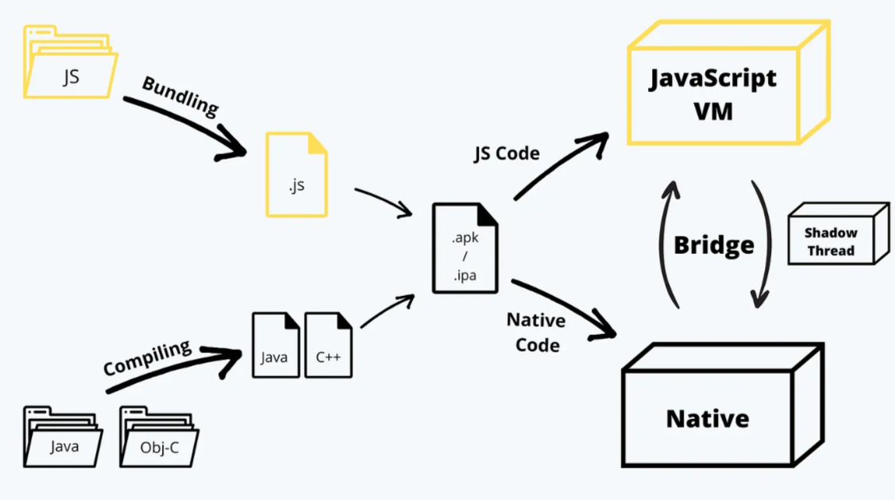

<style>
@import url('https://fonts.googleapis.com/css2?family=Prompt:ital,wght@0,100;0,300;0,400;0,700;1,100;1,300;1,400;1,700&display=swap');

    :root {
    font-family: Prompt;
    --hl-color: #D57E7E;
}
h1 {
  font-family: Prompt
}
</style>

# Fullstack Development

---

# Mobile development

---

# Case study

- **Your boss**: _I need you to make a counter app for me right now._
- **You**: _Sure, give me .... minutes._

---

# Expo

### The fastest way to make "counter" app materialize on your phone.

---

# Assume

- You know React.
- You and your boss have Android phones.

---

# Setup

- Create Expo account.
- Install required CLI tool
  - `npm install -g eas-cli`

---

# Steps

- `npx create-expo-app -t expo-template-blank-typescript`
- `npx expo install expo-updates` (For OTA update)

---

`App.tsx`

```ts
import { StatusBar } from "expo-status-bar";
import { StyleSheet, Text, View, Button } from "react-native";
import { useState } from "react";
export default function App() {
  const [count, setCount] = useState(0);
  return (
    <View style={styles.container}>
      <StatusBar backgroundColor="blue" />
      <Text style={{ fontSize: 50 }}>Counts: {count}</Text>
      <Button onPress={() => setCount((c) => c + 1)} title="Add" />
      <Button onPress={() => setCount(0)} title="Reset" color="red" />
    </View>
  );
}

const styles = StyleSheet.create({
  container: {
    flex: 1,
    backgroundColor: "#fff",
    alignItems: "center",
    justifyContent: "center",
    gap: 10,
  },
});
```

---

# Build

- `eas update:configure`
- `eas build:configure`
- `eas build --platform android --profile preview`

---

# Update

- `eas update --branch preview --message "Fix typo"`

---

# Overview of mobile development

---

# Mobile development

- Native
  - Andriod: Java or Kotlin
  - iOS: Objective-C or Swift
- Cross-platform
  - React Native: JavaScript
  - Flutter: Dart

---

# Native vs cross-platform

|                | Native | Cross-Platform |
| -------------- | ------ | -------------- |
| Time to market | Slow   | Fast           |
| Features       | Full   | Limited        |
| Performance    | More   | Less           |
| Cost           | More   | Less           |

---

# React Native vs Flutter

- Popularity: https://survey.stackoverflow.co/2023/#most-popular-technologies-misc-tech

---

# React Native vs Flutter

|                        | React Native                 | Flutter       |
| ---------------------- | ---------------------------- | ------------- |
| Language               | JavaScript                   | Dart          |
| UI                     | Native UI and iOS components | Custom widget |
| Dev API                | Core + 3rd party libs        | Core          |
| Dev option             | More versatile               | More guided   |
| Incompatibility issues | More                         | Less          |
| Performance            | Faster                       | Slower        |

[Source](https://www.sam-solutions.com/blog/flutter-vs-react-native/)

---

# React Native architecture


[Source](https://medium.com/front-end-weekly/how-does-react-native-work-understanding-the-architecture-d9d714e402e0)

---
